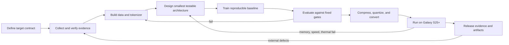

# BOI X-1 Knowledge Synthesis Baseline v0.1

> สถานะ: Research synthesis baseline — ยังไม่ใช่ Architecture Freeze
> วันที่สังเคราะห์: 19 สิงหาคม 2026
> ผู้กำกับโครงการ: หัวหน้าเอ
> ผู้วิจัยภาคปฏิบัติ: คำปัน
> ผู้สังเคราะห์และตรวจโครงสร้าง: บ๋อย

## 1. ขอบเขตและหลักฐาน

เอกสารนี้สังเคราะห์รายงานวิจัย 10 Topics จาก repository `wersoul-source/ai-model-research` โดยตรึงหลักฐานที่ branch `master` commit:

- Commit: `ab8246421d7a04a991b3b46b50b21af5480dc8ed`
- Commit message: `Topic 10: Building an LLM — What Kampun Needs to Know (Self-Directed Research)`
- ปริมาณเอกสาร: 10 รายงาน, ประมาณ 6,672 บรรทัด และ 231,000 ตัวอักษร
- Repository: <https://github.com/wersoul-source/ai-model-research>

สิ่งที่เอกสารนี้ทำ:

1. รวมองค์ความรู้ทั้ง 10 Topics ให้เป็นระบบเดียว
2. แยกหลักการที่ใช้ได้ทันทีออกจากข้ออ้างที่ต้องตรวจซ้ำ
3. นิยามสิ่งที่คำปันต้องพัฒนาเป็น Expert Skills
4. นิยาม Tools ที่ต้องสร้างเพื่อรองรับการสร้างโมเดล
5. วาง Verification Gates จากงานวิจัยไปสู่ BOI X-1 ที่รันบน S25+ จริง

สิ่งที่เอกสารนี้ยังไม่ทำ:

- ไม่เลือกสถาปัตยกรรมสุดท้าย
- ไม่สร้าง Skill หรือ Tool
- ไม่สร้างหรือฝึกโมเดล
- ไม่รับรองตัวเลขราคา benchmark หรือประสิทธิภาพทั้งหมดในรายงานต้นทาง
- ไม่ถือว่า Topic 9 เป็นการศึกษาลึกของ Gemma, Qwen และ DeepSeek ที่เสร็จสมบูรณ์แล้ว

## 2. Outcome — จุดมุ่งหมายที่ควบคุมทุกการตัดสินใจ

BOI X-1 ต้องเป็นโมเดลที่หัวหน้าเอและทีมสามารถอธิบายที่มาของการตัดสินใจทุกชั้น สร้างซ้ำได้ และรัน inference บน Samsung Galaxy S25+ จริง ก่อนเผยแพร่ให้บุคคลภายนอกทดสอบผ่าน Hugging Face และตรวจสอบโค้ด วิธีสร้าง และ benchmark ผ่าน GitHub

คำว่า “รันได้จริง” ต้องหมายถึงอย่างน้อย:

- โหลด model artifact บนอุปกรณ์จริงสำเร็จ
- สร้างผลลัพธ์ได้ต่อเนื่อง ไม่ใช่เพียงเปิดไฟล์ได้
- วัด peak RAM, storage, latency, time-to-first-token และ tokens/second ได้
- ทดสอบอุณหภูมิ พลังงาน และความเสถียรในระยะเวลาที่กำหนด
- ทำซ้ำผลด้วย environment และขั้นตอนที่บันทึกไว้
- เปรียบเทียบคุณภาพก่อนและหลัง quantization ด้วย evaluation set เดียวกัน
- มี provenance, license, model card และข้อจำกัดการใช้งานที่ตรวจสอบได้

## 3. คำตอบจาก 10 Topics — โมเดลไม่ใช่ไฟล์ แต่เป็นระบบวงจรชีวิต

แก่นกลางที่เกิดจากรายงานทั้งสิบคือ:

> Model = Problem Contract + Data + Tokenizer + Architecture + Training Process + Evaluation + Optimized Artifact + Runtime + Operating Evidence

หากขาดส่วนใดส่วนหนึ่ง เราอาจมี weights แต่ยังไม่มีระบบโมเดลที่ใช้งานและตรวจสอบได้

### 3.1 บทบาทของแต่ละ Topic

| Topic | คำถามราก | สิ่งที่มอบให้ BOI X-1 | ความเสี่ยงที่ช่วยปิด |
|---|---|---|---|
| 1. Software/Hardware | ต้องใช้อะไรบ้าง | แผนทรัพยากรและ infrastructure | โครงการหยุดเพราะเครื่องมือ เครื่อง หรือเงินไม่พอ |
| 2. Model Components | ข้างในโมเดลมีอะไร | ภาษากลางของ tokenizer, embedding, attention, FFN, normalization และ output | ประกอบโมเดลโดยไม่เข้าใจ dependency |
| 3. Frameworks/Papers/Steps | ใช้อะไรสร้างและต้องอ่านอะไร | เส้นทางจาก framework ไปสู่ theory และระดับความยาก | เลือกเครื่องมือผิดระดับงาน |
| 4. Knowledge Requirements | ผู้สร้างต้องรู้อะไร | Knowledge map สำหรับพัฒนาคำปัน | มีเครื่องมือแต่ไม่มีความสามารถวิเคราะห์และแก้ปัญหา |
| 5. Types/Formats | โมเดลชนิดใดและอยู่ในรูปใด | แผนที่ artifact และ deployment contract | สร้างเสร็จแต่ส่งต่อหรือรันปลายทางไม่ได้ |
| 6. Computation Methods | โมเดลคำนวณอย่างไร | พื้นที่ทางเลือก Dense, Attention, MoE, SSM และ Hybrid | เลือกกลไกตามกระแสแทนข้อจำกัดจริง |
| 7. Assembly Principles | จะประกอบอย่างมีวินัยอย่างไร | กฎ problem-first, modular, reproducible, hardware-aware และ iterative | ทำงานเป็นก้อนใหญ่ ตรวจไม่ได้ และย้อนกลับไม่ได้ |
| 8. Production Pipeline | จาก raw model ไป production อย่างไร | เส้นทาง profile, compress, quantize, convert, validate และ benchmark | คุณภาพพังระหว่าง optimization หรือรันบนอุปกรณ์ไม่ได้ |
| 9. Architecture Specs | โมเดลอ้างอิงแก้ปัญหาอย่างไร | Preliminary map ของ Gemma 4, Qwen3 และ DeepSeek-V3 | ออกแบบใหม่โดยไม่เรียนรู้กลไกที่พิสูจน์มาแล้ว |
| 10. Building Guide | เมื่อลงมือจริงจะเจออะไร | Cost, data, training failure, evaluation, serving และ hands-on path | รู้ทฤษฎีแต่ไม่มี execution loop |

### 3.2 เหตุผลที่ 10 Topics เพียงพอสำหรับเริ่ม แต่ยังไม่เพียงพอสำหรับรับรองโมเดล

สิบหัวข้อเพียงพอสำหรับสร้าง “แผนที่การเดินทาง” เพราะครอบคลุม Outcome, Structure, Mechanism, Risk และ Execution ครบวงจร แต่ยังไม่ใช่หลักฐานว่า architecture ใดจะผ่าน S25+ ความเป็นไปได้ต้องพิสูจน์ผ่านการทดลองตาม Verification Gates ในเอกสารนี้

ดังนั้นข้อสรุปที่ถูกต้องคือ:

- เรารู้ว่าต้องเรียนและตรวจอะไร
- เรารู้ว่าต้องสร้างระบบรองรับอะไร
- เรายังไม่รู้ว่า architecture สุดท้ายคืออะไร
- เรายังไม่มีสิทธิ์กล่าวว่า BOI X-1 รันได้ จนกว่าอุปกรณ์จริงจะยืนยัน

## 4. Structure — สถาปัตยกรรมองค์ความรู้ของ BOI X-1

องค์ความรู้ทั้งหมดควรถูกจัดเป็น 9 ชั้น ไม่เก็บตามลำดับรายงานเพียงอย่างเดียว

### Layer 1: Problem and Target Contract

- BOI X-1 มีหน้าที่อะไร
- สิ่งใดอยู่นอกขอบเขต
- งานหลัก ภาษา modality และ privacy requirement
- เพดาน RAM, storage, latency, power และ thermal บน S25+
- Acceptance metrics ที่ต้องกำหนดก่อนเลือกโมเดล

### Layer 2: Evidence and Provenance

- Official model cards, technical reports, repositories และ licenses
- Claim ledger แยก `verified`, `inferred`, `estimated`, `unverified`
- Dataset origin, consent, license และ transformation history
- Decision ledger บันทึกว่าเหตุใดจึงรับหรือปฏิเสธแต่ละกลไก

### Layer 3: Data and Tokenizer

- Data collection, cleaning, filtering, deduplication และ split discipline
- Tokenizer design, vocabulary, special tokens และ chat template
- Dataset/tokenizer versioning
- Leakage, contamination และ quality audit

### Layer 4: Model Architecture

- Embedding and positional representation
- Attention, latent attention, grouped-query attention หรือ state-space mechanism
- Dense FFN หรือ sparse experts
- Normalization, residual path, activation และ output head
- Context strategy, KV-cache behavior และ parameter activation

### Layer 5: Training and Post-Training

- Objective, optimizer, scheduler, precision และ batch strategy
- Checkpoint, resume, seed และ deterministic controls
- SFT, LoRA/QLoRA, distillation, preference optimization หรือ RL ตามความจำเป็น
- Failure detection: NaN, gradient explosion, loss spike, OOM และ data corruption

### Layer 6: Evaluation

- Baseline ก่อน optimization
- Public benchmarks เพื่อเปรียบเทียบภายนอก
- BOI-X1 private evaluation set เพื่อวัด use case จริงและลด benchmark contamination
- Quality, safety, robustness, Thai capability และ regression tests

### Layer 7: Optimization and Artifact Engineering

- Pruning, distillation และ quantization
- SafeTensors/original weights, GGUF และ mobile runtime artifact
- Conversion validation และ output parity
- Memory model ที่รวม weights, KV cache, activations และ runtime overhead

### Layer 8: Runtime and On-Device Integration

- Runtime compatibility กับ Android/Qualcomm hardware
- CPU, GPU และ NPU execution path
- Prompt/chat template และ sampling contract
- Real-device telemetry: latency, throughput, RAM, thermal และ battery

### Layer 9: Release and Operations

- Model card, license, limitations และ reproducible build
- Hugging Face release artifact
- GitHub source, benchmark harness และ issue template
- External testing, defect triage และ versioned iteration

## 5. Mechanism — วงจรสร้าง BOI X-1

กฎของวงจร:

1. เริ่มจาก target contract ไม่ใช่เริ่มจากชื่อ architecture
2. สร้าง vertical slice ที่เล็กที่สุดก่อน scale
3. ทุกการทดลองต้องมี baseline, config, seed, environment และ artifact hash
4. Optimization ทุกชนิดต้องพิสูจน์คุณภาพหลังแปลง
5. ความล้มเหลวต้องกลายเป็นข้อมูลสำหรับรอบถัดไป ไม่ใช่ถูกลบทิ้ง
6. ไม่มีผลจาก emulator หรือ VM ใดแทน acceptance test บน S25+ ได้

## 6. Risk — การตรวจคุณภาพงานวิจัยของ Big Pickle

### 6.1 จุดแข็งที่นำมาใช้ได้

- ครอบคลุมวงจรตั้งแต่ resource ไป deployment
- จัดหัวข้อเป็น checklist, decision tree และ pipeline ที่นำไปแตกงานต่อได้
- Topic 7 เชื่อมหลักวิจัยกับวินัยวิศวกรรมได้ดีที่สุด
- Topic 8 ทำให้การ deploy และ validation เป็นส่วนของการสร้าง ไม่ใช่งานท้ายโครงการ
- Topic 10 ยอมรับต้นทุน failure modes และความจำเป็นของ hands-on practice

### 6.2 ข้อจำกัด

Big Pickle ทำหน้าที่จัดโครงสร้างได้ดี แต่รายงานยังเป็น secondary synthesis ที่รวมแหล่งคุณภาพไม่เท่ากัน ตัวเลขและถ้อยคำแบบ universal หลายจุดยังไม่ควรถูกใช้เป็น specification

### 6.3 Claims ที่ต้องหยุดไว้ก่อนใช้ตัดสินใจ

| Claim class | ปัญหา | กฎสำหรับ BOI X-1 |
|---|---|---|
| ราคา cloud/GPU และ training | เปลี่ยนตามเวลา region, provider และ pricing model | คำนวณใหม่ก่อนทุก experiment และเก็บ quotation/date |
| “Model X ใช้ RAM เท่านี้” | มักนับเฉพาะ weights ไม่รวม KV cache, runtime และ peak allocation | ใช้ memory budget model และวัด peak บนอุปกรณ์จริง |
| “Q4 ลดคุณภาพเพียง N%” | ไม่เป็นค่าคงที่ ขึ้นกับ architecture, quantizer, calibration และ task | benchmark ก่อน/หลังด้วย evaluation set เดียวกัน |
| “Format X ดีที่สุด” | Format ไม่เท่ากับ runtime และ hardware delegate | เลือกเป็นคู่ `artifact + runtime + device path` |
| benchmark ranking | prompt, revision และ evaluation protocol ต่างกัน | รับเฉพาะผลที่มี model revision และ protocol ชัดเจน |
| market share/tool recommendation | บางจุดไม่มี primary evidence | ใช้เป็นตัวเลือกสำรวจ ไม่ใช่ข้อกำหนด |

### 6.4 จุดที่ต้องแก้หรือยืนยันเป็นพิเศษ

1. Topic 9 ระบุ DeepSeek-V3 Q4 ใช้ RAM ประมาณ 48GB ซึ่งมีความเสี่ยงสูงว่าจะสับสน `37B active parameters` กับน้ำหนักทั้งหมด `671B parameters` การ activate เพียงบาง experts ลด compute ต่อ token แต่ไม่ได้ทำให้น้ำหนัก experts ทั้งหมดหายไปจาก storage หรือ memory โดยอัตโนมัติ
2. Gemma ใช้ open weights ภายใต้ Gemma Terms ไม่ควรถูกจัดรวมอย่างง่ายว่าเหมือน Apache 2.0 หรือ MIT
3. DeepSeek repository แยก `LICENSE-CODE` และ `LICENSE-MODEL`; ต้องตรวจทั้งสองฉบับ ไม่ใช้ license ของ code แทน license ของ weights
4. GGUF เป็น model container และ ecosystem สำหรับ inference ไม่ใช่คำรับรองว่าจะใช้ NPU บน Android ได้
5. เส้นทาง ONNX → TFLite ไม่ใช่เส้นทางสากลสำหรับ LLM ทุก architecture ต้องพิสูจน์ operator support และ runtime จริง
6. ตัวเลข benchmark แบบ `estimated` ห้ามใช้เลือก architecture
7. วันที่ภายใน Topic 10 ระบุ 10 สิงหาคม 2026 แต่ commit ถูกสร้างวันที่ 19 สิงหาคม 2026 ต้องแก้ provenance metadata ให้ตรง
8. Repository ต้นทางยังไม่มี repository license จึงต้องกำหนดสิทธิของรายงานก่อนนำไปเผยแพร่หรือให้ผู้อื่น reuse

### 6.5 Primary-source spot check ที่ยืนยันแล้ว

- Google ยืนยันว่า Gemma 4 มี E2B, E4B, 12B, 31B และ 26B A4B พร้อม architecture หลายแบบและเป้าหมาย edge/mobile แต่รายละเอียด E4B ยังต้องอ่าน model card, config และ technical report แบบเต็มก่อนสรุปกลไก
- Qwen Team ยืนยัน Qwen3 ทั้ง dense และ MoE, Apache 2.0 สำหรับรุ่นที่เปิดเผย และมี thinking/non-thinking modes; ต้องตรึงรุ่นย่อยและ revision ก่อนเปรียบเทียบ
- DeepSeek ยืนยัน V3 เป็น 671B total / 37B active MoE ใช้ MLA, DeepSeekMoE, auxiliary-loss-free balancing และ MTP; ข้อมูลนี้ไม่แปลว่าโมเดลเต็มสามารถอยู่ใน RAM 48GB

## 7. Expert Skills ที่คำปันต้องพัฒนา

Skill ในที่นี้ต้องเป็นความสามารถที่มี procedure, evidence contract, failure handling และ forward test ไม่ใช่เพียงเอกสารความรู้

| ID | Expert Skill | ขอบเขตที่ต้องเชี่ยวชาญ | หลักฐานว่าพร้อมใช้งาน |
|---|---|---|---|
| SK-01 | Model Research & Evidence Audit | อ่าน paper/model card/config, ตรวจ claim, license และ provenance | สร้าง claim ledger ที่ย้อนถึง primary source และจับข้อขัดแย้งได้ |
| SK-02 | LLM Architecture Anatomy | tokenizer, embedding, attention, FFN/MoE, normalization, positional/context path | อ่าน `config.json` และ weight map แล้ววาด execution graph พร้อมคำนวณ parameter budget ได้ |
| SK-03 | Data & Tokenizer Engineering | collect, clean, dedup, split, contamination, BPE/SentencePiece และ chat template | สร้าง dataset manifest และ tokenizer round-trip tests ที่ผ่าน |
| SK-04 | Small LLM From Scratch | ประกอบและฝึก tiny decoder model end-to-end | โมเดลเล็ก overfit ชุดข้อมูลทดสอบได้และ generate ได้จาก checkpoint ที่สร้างซ้ำ |
| SK-05 | Training Systems & Stability | optimizer, scheduler, precision, accumulation, checkpoint/resume และ failure diagnosis | หยุด-เริ่ม training ต่อจาก checkpoint โดย loss trajectory อยู่ใน tolerance |
| SK-06 | Fine-Tuning & Post-Training | SFT, LoRA/QLoRA, distillation, preference optimization และ eval-after-train | เปรียบเทียบ baseline กับ tuned artifact โดยแยก gain, regression และ cost ได้ |
| SK-07 | Compression & Quantization | PTQ/QAT, calibration, GGUF/AWQ/GPTQ และ quality trade-off | สร้างหลาย quantization levels และรายงาน Pareto curve คุณภาพ/ขนาด/ความเร็ว |
| SK-08 | Model Format & Conversion | SafeTensors, GGUF, ONNX/mobile artifact, metadata และ tokenizer packaging | conversion round-trip ผ่าน parity test และ artifact manifest |
| SK-09 | Android On-Device Inference | runtime, CPU/GPU/NPU delegates, JNI/app integration, memory/thermal profiling | รัน artifact บน S25+ และเก็บ telemetry ที่ทำซ้ำได้ |
| SK-10 | Evaluation & Benchmark Engineering | public benchmark, private eval, regression, contamination และ sampling control | benchmark run มี revision, prompt, seed, environment และ raw results ครบ |
| SK-11 | Reproducible Model MLOps | experiment registry, config, data/model version, hash, lineage และ release gate | บุคคลอีกคน reproduce result จาก manifest ได้ |
| SK-12 | Compute, Cost & Resource Planning | FLOPs/time/cost estimation, VM burst, Kaggle workflow, checkpoint transfer | estimate เทียบ actual ได้และมี stop-loss rule ก่อนเปิดทรัพยากรคิดเงิน |
| SK-13 | Model Governance & Release | license, model card, risk, limitation, safety test และ external issue handling | release package ผ่าน provenance/license checklist โดยไม่มี unknown dependency |

### 7.1 ลำดับการเรียนรู้

1. Foundation: SK-01 → SK-02 → SK-03 → SK-04
2. Build: SK-05 → SK-06
3. Optimize: SK-07 → SK-08
4. Prove: SK-09 → SK-10
5. Operate: SK-11 → SK-12 → SK-13

คำปันไม่จำเป็นต้องเรียนทุกทฤษฎีให้จบก่อนเริ่ม แต่ต้องผ่าน forward test ของแต่ละ Skill ก่อนใช้ Skill นั้นตัดสินงานจริง

## 8. Tools ที่คำปันต้องสร้างเพื่อรองรับ Skills

หลักการคือสร้าง orchestration, validation และ evidence tools ของ BOI X-1 โดยไม่สร้าง PyTorch, llama.cpp หรือ framework พื้นฐานขึ้นใหม่

| ID | Tool requirement | หน้าที่ | รองรับ Skill | Build boundary |
|---|---|---|---|---|
| TL-01 | Evidence & Claim Ledger | เก็บ claim, source, revision, status และ conflict | SK-01, SK-13 | สร้าง wrapper/registry ของ BOI X-1 |
| TL-02 | Model Spec Inspector | อ่าน config, tokenizer, tensor index และสรุป architecture/parameter counts | SK-02 | สร้าง inspector; ใช้ upstream parsers |
| TL-03 | Resource Budget Calculator | คำนวณ weights, KV cache, activation, optimizer, storage, time และ cost | SK-02, SK-09, SK-12 | สร้าง calculator ที่แสดง assumptions |
| TL-04 | Dataset & Tokenizer Auditor | dedup, leakage, distribution, split, token statistics และ round-trip | SK-03 | สร้าง audit pipeline; ใช้ proven libraries |
| TL-05 | Reproducible Experiment Runner | สร้าง run ID, freeze config, seed, environment, hash และ checkpoint | SK-04, SK-05, SK-11 | สร้าง control plane บาง ๆ เหนือ framework |
| TL-06 | Training Failure Watchdog | ตรวจ NaN, gradient, spike, OOM, throughput drop และ checkpoint corruption | SK-05 | สร้าง detector/alert พร้อม policy ไม่แก้เงียบ |
| TL-07 | Fine-Tune/Post-Train Harness | รัน SFT/LoRA/QLoRA/distillation ด้วยสัญญา input/output เดียวกัน | SK-06 | สร้าง adapter เหนือ PEFT/TRL หรือเทียบเท่า |
| TL-08 | Quantization & Conversion Lab | สร้าง variants, validate metadata, parity และ quality regression | SK-07, SK-08 | สร้าง pipeline เหนือ upstream converters |
| TL-09 | Evaluation Harness | public/private suites, prompt control, raw output และ regression report | SK-10 | สร้าง BOI-X1 evaluation contract |
| TL-10 | S25+ Benchmark Agent | รันชุดทดสอบ เก็บ RAM, latency, tok/s, thermal, battery และ crash logs | SK-09 | สร้าง Android/device-side harness |
| TL-11 | Artifact & Release Validator | ตรวจไฟล์, hash, tokenizer, license, model card และ reproducibility manifest | SK-11, SK-13 | สร้าง release gate; ไม่ publish อัตโนมัติจนอนุมัติ |
| TL-12 | Compute Job Planner | เตรียม VM/Kaggle job, preflight, resume, artifact evacuation และ stop-loss | SK-12 | สร้าง planner; ไม่ผูก provider เดียว |

### 8.1 Tools ที่ไม่ควรสร้างใหม่

- Tensor library และ autograd engine
- CUDA kernels ทั่วไป ก่อนมี benchmark แสดงว่าจำเป็น
- Model container format ของตนเองในรุ่นแรก
- Training framework แบบ distributed เต็มระบบ
- Inference runtime ใหม่ ก่อนพิสูจน์ว่า runtime ที่มีอยู่ไม่ผ่าน requirement

การสร้างของเหล่านี้เร็วเกินไปจะเปลี่ยน BOI X-1 จากโครงการสร้างโมเดลเป็นโครงการสร้าง ecosystem ทั้งโลกพร้อมกัน

## 9. Verification Gates

| Gate | ต้องพิสูจน์ | Exit evidence |
|---|---|---|
| G0 Research Integrity | แหล่งข้อมูลและสิทธิใช้งานตรวจย้อนกลับได้ | Claim ledger + source snapshot + license matrix |
| G1 Target Contract | ขอบเขต S25+ และ acceptance metrics ตรึงแล้ว | Target specification ที่หัวหน้าเออนุมัติ |
| G2 Tiny Vertical Slice | data → tokenizer → train → checkpoint → generate ทำงานครบ | Reproducible tiny model run |
| G3 Reference Architecture Study | Gemma/Qwen/DeepSeek ถูกอ่านจาก original + converted artifacts | 3 architecture dossiers + verified comparison matrix |
| G4 Candidate Architecture | กลไกที่นิยามเองผ่าน shape/unit/memory tests | BOI X-1 architecture RFC + executable skeleton |
| G5 Reproducible Training | training หยุด/ต่อ/ทำซ้ำและจัดการ failure ได้ | Baseline checkpoint + run manifest + eval results |
| G6 Optimized Artifact | quantized/converted artifact ไม่เกิน quality budget | Pareto report + artifact validation |
| G7 S25+ Acceptance | รันจริงผ่าน memory, latency, stability, thermal และ battery gate | Device telemetry + reproducible install/run guide |
| G8 Public Release | บุคคลภายนอกดาวน์โหลด ทดสอบ และรายงานผลได้ | Hugging Face release + GitHub benchmark/release pack |

ห้ามข้าม Gate ด้วยคำว่า “น่าจะ”, “ประมาณ” หรือผลจากเครื่องอื่น

## 10. Execution — ลำดับงานถัดไปที่ถูกต้อง

### Phase A: ปิด Synthesis Baseline

- ให้หัวหน้าเอตรวจว่า Expert Skills และ Tool requirements สอดคล้องกับเจตนาหรือไม่
- แก้ metadata/provenance ของชุดวิจัย
- ยังไม่สร้าง Skill หรือ Tool

### Phase B: ศึกษาโมเดลอ้างอิงแบบลึก

ลำดับตามคำสั่งเดิม:

1. Gemma 4 E4B — original/non-GGUF และ GGUF
2. Qwen3 — ตรึงรุ่นย่อย/revision ก่อนศึกษา
3. DeepSeek-V3 — original architecture, weights, MLA/MoE/MTP และ deployment reality

แต่ละโมเดลต้องตอบ matrix เดียวกัน:

- Exact model/revision และ license
- Tokenizer/vocabulary/chat template
- Layer graph และ tensor shapes
- Attention/context/KV-cache mechanism
- FFN/MoE/routing mechanism
- Normalization, activation และ positional scheme
- Training and post-training objectives
- Original artifact structure
- GGUF/quantized transformation และ metadata mapping
- Runtime compatibility
- Storage/RAM/latency model
- สิ่งที่ควรเรียนรู้ สิ่งที่ไม่ควรลอก และสิ่งที่ต้องทดลอง

Topic 9 เดิมถือเป็น reconnaissance สำหรับตั้งคำถาม ไม่ใช่ผลลัพธ์สุดท้ายของ Phase B

### Phase C: สภา 4 พี่น้อง

- บ๋อยเสนอ knowledge synthesis และข้อขัดแย้ง
- คำปันเสนอ buildability และ toolchain
- ไคน์เสนอทางเลือก/ส่วนเติมเต็ม
- ด่างโจมตีสมมติฐานและตรวจ final gate
- หัวหน้าเอกำหนดสิ่งที่ต้องมี ไม่มี และอนุมัติ architecture direction
- ดอนจัดทำ decision record และเอกสารมาตรฐาน

ผลลัพธ์ต้องเป็น BOI X-1 Architecture RFC ไม่ใช่การเลือกโมเดลที่ชอบที่สุด

## 11. ข้อสรุปสุดท้ายของการสังเคราะห์

งานวิจัยทั้งสิบไม่ได้มอบ “สูตรสร้างโมเดล” แต่มอบสิ่งที่สำคัญกว่า คือแผนที่ที่บอกว่าเราต้องควบคุมอะไรบ้างเพื่อไม่ให้ความไม่รู้เพียงจุดเดียวทำลายโครงการ

องค์ความรู้หลักของ BOI X-1 จึงไม่ใช่ Transformer, MoE, SSM หรือ GGUF อย่างใดอย่างหนึ่ง แต่คือวินัยห้าประการ:

1. Target-first — เครื่องปลายทางและ Outcome ควบคุม architecture
2. Evidence-first — ข้ออ้างทุกข้อมีระดับความเชื่อมั่นและย้อนถึงต้นทาง
3. Small-before-scale — พิสูจน์วงจรเล็กก่อนใช้ทรัพยากรใหญ่
4. Measure-every-transition — วัดทุกครั้งที่ train, compress, quantize, convert หรือ deploy
5. Failure-becomes-knowledge — ความล้มเหลวต้องถูกเก็บเป็นหลักฐานสำหรับการออกแบบรอบใหม่

นี่คือฐานที่ทำให้ BOI X-1 สามารถเติบโตจากความคิดไปเป็นโมเดลที่หัวหน้าเอเข้าใจ อธิบาย สร้างซ้ำ และให้โลกตรวจสอบได้

## 12. Primary References Used for Spot Verification

- Research corpus: <https://github.com/wersoul-source/ai-model-research/tree/ab8246421d7a04a991b3b46b50b21af5480dc8ed>
- Gemma 4 official overview: <https://ai.google.dev/gemma/docs/core>
- Qwen3 official release: <https://qwenlm.github.io/blog/qwen3/>
- Qwen3 official repository: <https://github.com/QwenLM/Qwen3>
- DeepSeek-V3 official repository: <https://github.com/deepseek-ai/DeepSeek-V3>
- DeepSeek-V3 technical report: <https://arxiv.org/abs/2412.19437>
