# บทที่ 4 — เปรียบเทียบ 6 มิติ: คิด · น้ำหนัก · เหตุผล · ใช้งาน · ต่อเนื่อง · ผลลัพธ์

> หนึ่งมิติต่อหนึ่ง section — แต่ละมิติปิดด้วย "ผู้ชนะ" พร้อมเหตุผลเชิงโครงสร้าง
> Benchmark จาก llmbase.ai (harness เดียวกัน) — ใช้เทียบสัดส่วน

## 4.1 มิติที่ ① การคิด (Thinking Modes)

| | Qwen3-4B | Gemma 4 E4B-it | Llama 3.1 8B |
|---|---|---|---|
| Native thinking | ✓ **3 ชั้น**: flag + `<think>` tokens + `/think` switch | ✗ | ✗ |
| สลับโหมด runtime | ✓ ได้ทุก turn ไม่ retrain | — | — |
| กลไก | token budget ใน template | — | — |

**ข้อสังเกตเชิงโครงสร้าง:** thinking mode ของ Qwen ไม่ได้อยู่ใน weights — มันอยู่ใน **chat_template + special tokens** (151667/151668) แปลว่า "การคิด" ถูกฝังที่ interface layer ไม่ใช่ architecture layer

**🥇 ผู้ชนะ: Qwen3-4B** — ตัวเดียวที่คิดก่อนตอบได้แบบ native

## 4.2 มิติที่ ② น้ำหนัก (Weights & Memory)

| | Qwen3-4B | Gemma 4 E4B-it | Llama 3.1 8B |
|---|---|---|---|
| Total params | 4.02B | 8.00B | 8.03B |
| Effective params | ~4.02B | **~4.5B** (PLE design) | 8.03B |
| BF16 ขนาดจริง | 8.04 GB | 15.99 GB | 16.06 GB |
| GGUF Q4_K_M | **2.50 GB** | (~4–5 GB*) | 4.92 GB |
| RAM ต่ำสุดที่รันได้ (Q4) | ~4 GB | ~6–7 GB* | ~6 GB |

*\*Gemma GGUF ยังไม่ได้ตรวจ — ประมาณจาก effective params*

**ข้อสังเกต:** Gemma "จ่าย disk 16GB ได้ work 4.5B" — PLE ทำให้ knowledge depth มากแต่ compute cost น้อย ต่างจาก Llama ที่ 8B คือ 8B จริง (บวก no-tie อีก 13%)

**🥇 ผู้ชนะ: Qwen3-4B** — เล็กสุด 2 เท่า แต่ไม่แพงด้านความสามารถ (ดู 4.3)

## 4.3 มิติที่ ③ การให้เหตุผล (Reasoning Benchmarks)

**กราฟเทียบ 5 benchmark หลัก (score %):**

```mermaid
xychart-beta
    title "Reasoning Benchmarks — Qwen3-4B(R) vs Gemma E4B vs Llama 8B"
    x-axis ["GPQA", "MMLU-Pro", "MATH500", "AIME", "LiveCodeBench"]
    y-axis "Score %" 0 --> 100
    bar [52.2, 69.6, 93.3, 65.7, 46.5]
    bar [27.8, 48.3, 74.9, 10.7, 13.8]
    bar [25.9, 47.6, 51.9, 4.3, 11.6]
```

| Benchmark | วัดอะไร | Qwen3-4B (R) | Gemma E4B | Llama 8B |
|---|---|---|---|---|
| GPQA | วิทยาศาสตร์ระดับ PhD | **52.2%** | 27.8% | 25.9% |
| MMLU-Pro | ความรู้รอบด้านยาก | **69.6%** | 48.3% | 47.6% |
| MATH500 | คณิตศาสตร์ | **93.3%** | 74.9% | 51.9% |
| AIME (Original) | โจทย์โอลิมปิก | **65.7%** | 10.7% | 4.3% |
| LiveCodeBench | เขียนโค้ดสด | **46.5%** | 13.8% | 11.6% |

**ข้อสังเกตสำคัญ — thinking toggle มีผลจริง:**

```mermaid
xychart-beta
    title "Qwen3-4B: Reasoning ON vs OFF (same weights!)"
    x-axis ["GPQA", "MMLU-Pro", "MATH500", "LiveCodeBench"]
    y-axis "Score %" 0 --> 100
    bar [52.2, 69.6, 93.3, 46.5]
    bar [39.8, 58.6, 84.3, 23.3]
```

เปิด thinking → GPQA +12.4, MATH500 +9.0, LiveCodeBench **+23.2** — น้ำหนักชุดเดิม แค่เปลี่ยน template

**🥇 ผู้ชนะ: Qwen3-4B** — เหนือกว่าทุก benchmark ทั้งที่เล็กกว่า 2 เท่า — พิสูจน์ว่า data quality + training recipe ชนะ parameter count

## 4.4 มิติที่ ④ การใช้งาน (Use Cases)

| Use case | ตัวที่เหมาะสุด | เหตุผล |
|---|---|---|
| Chatbot ธรรมดา | ทั้งสาม | ทำได้หมด |
| Agent / tool calling | Qwen หรือ Llama | tool-call tokens ครบ Gemma มีแต่จำกัดกว่า |
| แปลภาษา / multilingual | Qwen (119 ภาษา) | vocab 152K + training mix |
| ดูภาพ / ฟังเสียง / วิดีโอ | **Gemma เท่านั้น** | multimodal native — vision 280 soft-tokens/ภาพ, audio 750 tokens/30s |
| RAG เอกสารยาว | Gemma หรือ Llama | context mechanics (ดู 4.5 + บท 5) |
| รันบนมือถือ/edge | Qwen Q4 | 2.5GB + KV cache เล็ก |
| Fine-tune domain เฉพาะ | Llama | ecosystem LoRA ใหญ่สุด + no-tie flexible |

**🥇 ผู้ชนะ: Gemma 4 E4B-it** (multimodal ทำสิ่งที่อีกสองตัวทำไม่ได้เลย)

## 4.5 มิติที่ ⑤ ความต่อเนื่อง (Context & Continuity)

| | Qwen3-4B | Gemma 4 E4B-it | Llama 3.1 8B |
|---|---|---|---|
| Context ประกาศ | 32K → **128K** (YaRN ×4) | **128K** | 8K → **128K** (llama3 ×8) |
| Attention design | full ทุก layer | hybrid sliding 512 ×35 + global ×7 | full ทุก layer |
| KV cache @128K (FP16) | ~18.9 GB | **~3.7 GB** | ~16.1 GB |
| จำย้อนหลังได้จริง | ทุก token | global layers เท่านั้น (window 512 นอกนั้น) | ทุก token |

**ข้อสังเกต:** ตัวเลข "128K" เท่ากัน แต่ **ความหมายต่างกัน** — Qwen/Llama จำทุก token (แต่จ่าย RAM แพง), Gemma จำ long-range ผ่าน 7 global layers และ local detail ผ่าน window 512 — trade-off คนละแบบ (เจาะลึกในบท 5)

**🥇 ผู้ชนะ: Gemma** ด้าน memory efficiency / **Llama** ด้าน native simplicity — เสมอกันตามเป้าหมายใช้งาน

## 4.6 มิติที่ ⑥ การสร้างผลลัพธ์ (Output Generation)

| | Qwen3-4B | Gemma 4 E4B-it | Llama 3.1 8B |
|---|---|---|---|
| Vocab (logits width) | 151,936 | 262,144 | 128,256 |
| EOS discipline | eos pair [151645, 151643] | array [1, 106, 50] | **ซ้อน 3 ระดับ** (text/eom/eot) |
| Throughput (ref env) | ~100–150 tok/s* | 50.1 tok/s | **180.3 tok/s** |
| Output control | thinking budget | variable token budget | eom/eot mid-turn stop |

*\*ประมาณจากสัดส่วน params — ไม่มี measurement ตรง*

**ข้อสังเกต:** vocab ใหญ่ = logits tensor ใหญ่ = memory ต่อ step มากขึ้น แต่ token ต่อคำไทย/จีน น้อยลง — Gemma 262K ครอบคลุมภาษามากสุด แลก memory softmax ใหญ่สุด

**🥇 ผู้ชนะ: Llama 3.1** — เร็วสุด + EOS 3 ระดับคุมการจบ turn ละเอียดสุด

## 4.7 สรุป 6 มิติ — ตารางทอง

| มิติ | 🥇 | รอง |
|---|---|---|
| ① การคิด | **Qwen3-4B** | — (อีกสองตัวไม่มี) |
| ② น้ำหนัก/memory | **Qwen3-4B** | Gemma (effective 4.5B) |
| ③ เหตุผล | **Qwen3-4B** | Gemma ≈ Llama |
| ④ การใช้งาน | **Gemma** (multimodal) | Qwen (thinking agent) |
| ⑤ ความต่อเนื่อง | **Gemma** (KV cache) = Llama (native) | Qwen (แพง RAM) |
| ⑥ ผลลัพธ์ | **Llama** (speed + EOS) | Qwen |

---

*ไปต่อ: บทที่ 5 — Context Window Deep Dive*
